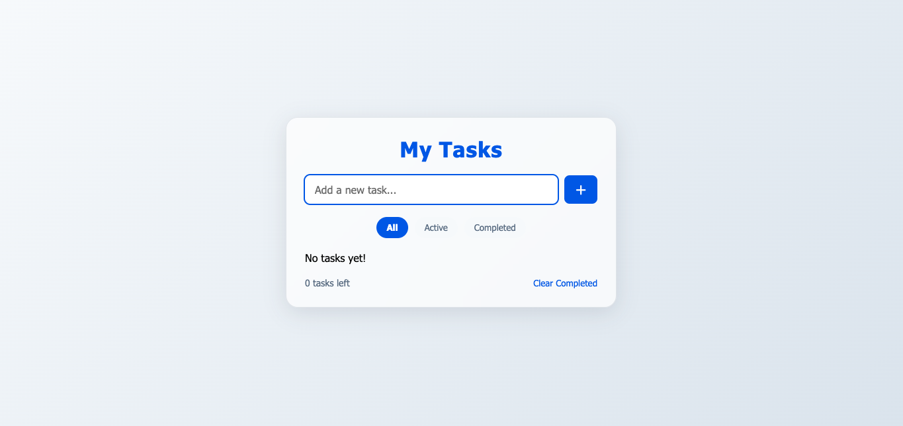

# Modern Todo App

A sleek, modern, and responsive Todo App built with vanilla JavaScript, HTML, and CSS. Perfect for tracking your daily tasks with a beautiful UI and persistent storage.

<p align="center">
  
</p>

## Features
- Add, edit, delete, and complete tasks
- Filter tasks (All, Active, Completed)
- Persistent storage with localStorage
- Responsive, modern glassmorphism UI
- Snackbar notifications for user actions
- Keyboard accessibility

## Getting Started

1. **Clone the repository:**
   ```bash
   git clone https://github.com/Chams-sat/Todo-app.git
   cd Todo-app
   ```
2. **Open `index.html` in your browser.**
   - No build step or dependencies required!

## Deployment
- You can deploy this app easily using [GitHub Pages](https://pages.github.com/), [Vercel](https://vercel.com/), or [Netlify](https://www.netlify.com/).


## Credits
- Designed and developed by Chams Satour.
- Inspired by modern UI/UX best practices 